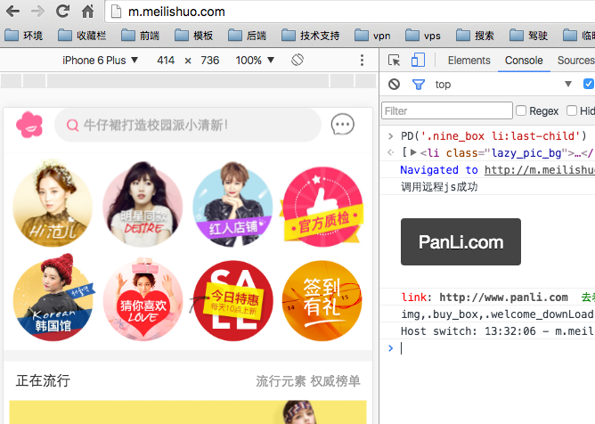
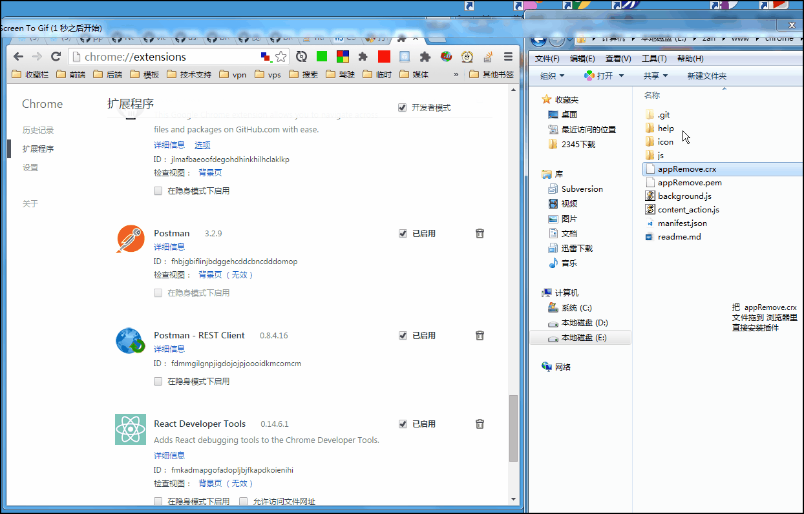
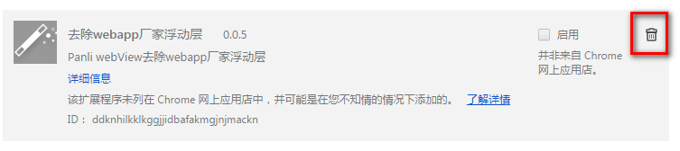
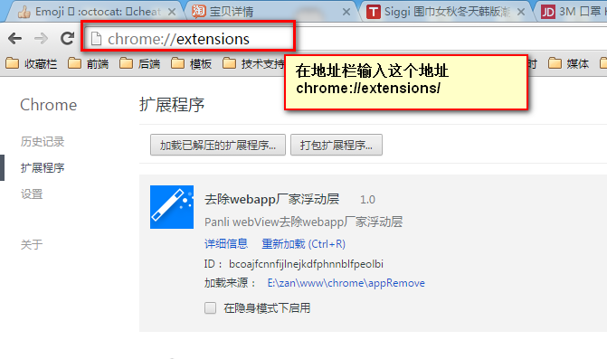
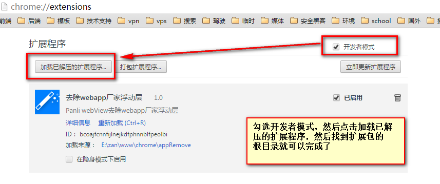

## Panli app webView 删除厂家广告浮动元素 开发测试调试利器

webKit 浏览器扩展

## 遇到问题

App 打开厂家页面浏览时 发现广告等了好久 （页面加载完成后 超过 1s）都没有删除

1. 第一步：PC 浏览器 打开输入 APP 打开的页面的网址 ， 开启本扩展 查看是否 会删除
2. 第二步：PC 浏览器 如果 删除了 证明 删除厂家广告的 脚本无问题
3. 第三步: 左转 -> 寻找 原生 APP 开发者 ,是否加载该脚本
4. 第四步：PC 浏览器也没有删除,请寻找 本扩展 开发人员 @Julian
5. 第五步: [去提交工单](http://github.panli.com/Julian/App-remove/issues)
6. 第六步: 提交工单时请 标注一下 **厂家具体地址**


## 安装

[浏览器扩展下载地址](http://github.panli.com/Julian/App-remove/raw/master/appRemove.crx)


当安装好浏览器扩展后, 就可以在浏览器地址 输入 厂家的 地址了 ,
加载完页面后,过500毫秒 就会把厂家的 弹窗广告删掉




线上脚本 地址

> http:sf.panli.com/Ued/H5/elementRemove/js/appcreat.min.js


## v0.1.8

- 蘑菇街新版
    - 去除头部广告


## v0.1.8

- 聚划算 jhs.m.taobao.com 
    - 聚划算：希望可以屏蔽打开后的那个引导下载app的层。
    
    


>0.0.9

> 蘑菇街bug 什么值得买


>0.0.9

>增加 lifevc.com


---

>0.0.8

>增加遗漏的 1688.com

---


>0.0.7

>增加遗漏的 http 协议的 taobao.com

>新增 淘宝搜索页面列表中部的 app下载 广告


---


>0.0.6

> 厂家增加 共支持一下啊厂家

> **特别说明** 在 `lefeng.com` (乐峰) 厂家的 webapp 页面 

> 采用的是 `reactjs` 和 `webpack` 虚拟 `dom` 技术架构 ，因为无法操作 随机哈希 的 虚拟 `dom` 元素

```
"*://*.tmall.com/*",
"*://*.taobao.com/*",
"*://*.yixun.com/*",
"*://*.suning.com/*",
"*://*.yhd.com/*",
"*://*.dangdang.com/*",
"*://*.vancl.com/*",
"*://*.amazon.cn/*",
"*://*.amazon.com/*",
"*://*.mogujie.com/*",
"*://*.meilishuo.com/*",
"*://*.smzdm.com/*",
"*://*.vip.com/*",
"*://*.jumei.com/*",
"*://*.mbaobao.com/*",
"*://*.moonbasa.com/*",
"*://*.lefeng.com/*",
"*://*.paipai.com/*",
"*://*.shopin.net/*",
"*://*.gome.com.cn/*",
"*://*.quwan.com/*",
"*://*.yaofang.com/*",
"*://*.jxdyf.com/*",
"*://*.chunshuitang.com/*",
"*://*.jd.com/*",
"*://*.1688.com/*",
"*://*.lifevc.com/*"

```


---

>v0.0.5
>目录结构优化

>v0.0.4
> 新增 `https` 协议 为适应 `https` 的厂家


>v0.0.3

>消息通知 生成 .crx文件 拖拽安装


>v0.0.2

攻克淘宝的 哈希 元素 模糊查找元素删除

> 目前已经实现 tmall.com ,taobao.com, jd.com 

等待陆续添加


>v0.0.1

方便 `PanLi ` 开发 , 测试，产品 在测试 浏览页面时 观察结果
响应的数据结构是否正确

Panli webView去除webapp厂家浮动层

> 目前只支持 tmall.com  和 jd.com 

由于淘宝 的 浮动层为 随机算法哈希值生成 元素的 `id` 和 `class`

无法获取 元素 以及操作元素

## 内部使用, 暂不上传应用商店

本应用仅供开发测试使用 ，请误做非法错误,如有无法判断的事件，作者概不负责。

## 如何安装 (新方法安装)

1. 请先下载本程序 解压出来, 然后打开谷歌浏览器,在浏览器地址输入 `chrome://extensions/` 

2. 然后在解压文件夹里 找到 `appRemove.crx` 拖到 浏览器里 既可以安装了 ， 由于没有加入谷歌开发商店里，会提示安全问题,请无视吧

3. view

> 


## 被 Chrome 浏览器强制停止

在使用新方法安装后，谷歌浏览器会定时检测 插件是否在应用商店，
如果应用商店没有，则会强制停止使用，这时您只需如下示意图，点击删除图标，重新拖拽安装。


> 


## 如何安装 (老方法安装)

1. 请先下载本程序 解压出来, 然后打开谷歌浏览器,在浏览器地址输入 `chrome://extensions/` 

2. 


3. 

4. 然后浏览器 各个厂家的 webapp 页面把, 网速慢的情况下 ，你会看到 各个厂家的 浮动层 消失


5. 安装好后 浏览器访问 

https://detail.m.tmall.com/item.htm?id=521628888465, 

http://item.m.jd.com/product/1098344.html,


http://h5.m.taobao.com/awp/core/detail.htm?id=525658240175


##　提交网址

如果在浏览测试中发现 版本内支持的网站没有去除，请提交网址发给我 @julian